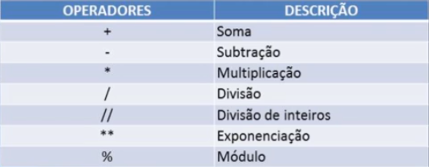
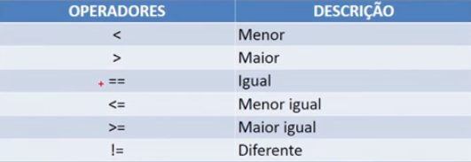
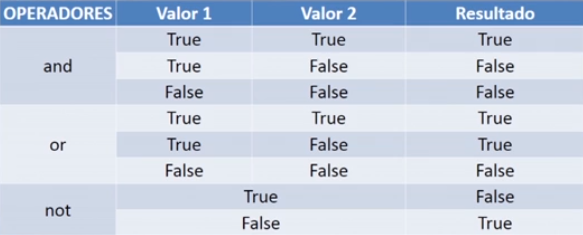

# estudo-devops-python

> Repositório para estudo da linguagem Python.

---

### Conteúdo do Repositório

* [./Curso-Impacta/](https://github.com/Gustavo-RibMartins/estudo-devops-python/tree/main/Curso-Impacta "Curso de Python do MBA da Impacta"): Código-Fonte gerado durante o curso de Python do MBA em Cloud Computing & DevOps da Impacta.

---
### 1. Introdução

Python na versão 2.0 foi criado em 2000 e a versão 3.0 em 2008.

Mac OS e Linux já vem com Python instalado por default, mas é possível instalar o Python ou atualizar a versão acessando o site [python.org](https://www.python.org/ "https://www.python.org/")

#### 1.1. Comandos Úteis:

##### i) type

Sintaxe
```python
type(<var>) # mostra a tipagem da variável
```
Exemplo
```python
type("variavel_teste")
```
Retorno
```python
<class 'str'>
```

##### ii) dir

Sintaxe
```python
dir(<var>) # mostra os métodos aplicáveis a variável
```
Exemplo
```python
dir(100)
```
Retorno
```python
['__abs__', '__add__', '__and__', '__bool__', '__ceil__', '__class__', '__delattr__', '__dir__', '__divmod__', '__doc__', '__eq__', '__float__', '__floor__', '__floordiv__', '__format__', '__ge__', '__getattribute__', '__getnewargs__', '__gt__', '__hash__', '__index__', '__init__', '__init_subclass__', '__int__', '__invert__', '__le__', '__lshift__', '__lt__', '__mod__', '__mul__', '__ne__', '__neg__', '__new__', '__or__', '__pos__', '__pow__', '__radd__', '__rand__', '__rdivmod__', '__reduce__', '__reduce_ex__', '__repr__', '__rfloordiv__', '__rlshift__', '__rmod__', '__rmul__', '__ror__', '__round__', '__rpow__', '__rrshift__', '__rshift__', '__rsub__', '__rtruediv__', '__rxor__', '__setattr__', '__sizeof__', '__str__', '__sub__', '__subclasshook__', '__truediv__', '__trunc__', '__xor__', 'as_integer_ratio', 'bit_count', 'bit_length', 'conjugate', 'denominator', 'from_bytes', 'imag', 'numerator', 'real', 'to_bytes']
```

##### iii) help

Sintaxe
```python
help(<var>.metodo) # mostra a documentação do método
```
Exemplo
```python
help("test".upper)
```
Retorno
```python
Help on built-in function upper:

upper() method of builtins.str instance
    Return a copy of the string converted to uppercase.
```
---
### 2. Variáveis

No Python, as variáveis são sempre passadas por **referência**, e não por valor.
Por exemplo, se for chamado o método `fillTrash()` que preenche a variável `trash`, tanto o resultado do método quanto a variável assumirão o valor alterado.


No Python não é preciso declarar o tipo da variável.

Utilizamos 3 tipos de dados:

```Python
Inteiros:           10, 2, 50000
Ponto Flutuante:    3.14, 1.2345
String:             "A", "R2D2"
```

#### 2.1. Tipagem Dinâmica

O Python permite que você faça a atribuição de uma variável sem informar o seu tipo, apenas passando o seu valor.

```Python
a=10
type(a)
# output
<class 'int'>
```

#### 2.2. Tipagem Forte

Por não precisar que o tipo da variável seja declarado, para o Python é essencial que a variável receba valores e chamadas de métodos consistentes com o valor com o qual é iniciada.

por exemplo, imagine que tentemos somar um inteiro `varInt` com uma string `varString`, obteremos o seguinte erro:

```Python
varInt = 10
varString = 'Texto'
varInt + varString
# output
Traceback (most recent call last):
  File "<pyshell#15>", line 1, in <module>
    varInt + varString
TypeError: unsupported operand type(s) for +: 'int' and 'str'
```
Entretanto, o tipo da variável pode mudar ao longo do tempo:
```Python
a = 10
type(a)
<class 'int'>
# reatribuição
a = '10'
type(a)
<class 'str'>
```

---
### 3. Operadores

#### 3.1. Aritméticos



#### 3.2. Relacionais



#### 3.3. Lógicos



---
### 4. Entrada e Saída de Dados

Para receber dados de entrada, utiliza=se a função `input()`, que retorna uma string:

```python
a = input("Digite um número inteiro: ")
b = input("Digite outro número inteiro: ")

print(a + b)

Supondo que a = 20 e b = 35, a saída é: 2035
```

Podemos imprimir dados separando os argumentos na função `print()` por vírgula:

```python
print("Imprimindo", "com", "Python")

# Saída
Imprimindo com Python
```

**Impressão com marcadores**

```python
a = 10
print("Tirei %d na prova" %a)

# Saída
Tirei 10 na prova
```

Os marcadores são:
- %d = para inteiros
- %s = para strings
- %f = para ponto flutuante

Para ponto flutuante, pode-se definir o número de casas decimais substituindo o valor de n em `%.nf`

```python
print("A nota é: %.2f" %8.9876)

# Saída
A nota é: 8.99
```

Também é possível usar vários marcadores usando listas:

```python
print("inteiro: %d, float: %.3f, string: %s" %(2, 3.12345, "texto"))

# Saída
inteiro: 2, float: 3.123, string: texto
```

---
### 5. Estrutura de Controle

#### 5.1. Condicional

O condicional no Python é identado e a sintaxe é a seguinte:
```python
if <condição 1>:
    <comando>
elif <condição 2>:
    <comando>
else:
    <comando>
```
Exemplo:
```python
nota = 8
media = 6

if nota >= media:
    print("Aprovado!")
else:
    print("Reprovado!")
```

#### 5.2. Laços de Repetição

Sintaxe `for()` loop:

```python
for(<variavel>) in range(n):
  <comandos>
```
Exemplo:
```python
for(x) in range(10):
  print(x)

# Saída
0
1
2
3
4
5
6
7
8
9
# Perceba que o range(10) vai de 0 a 9
```
Também é possível fazer um laço de repetição com `while()`. A sintaxe é a seguinte:
```python
while <condição para x>:
  <comandos>
  <incremento de x>
```
Exemplo:
```python
y= 5
while y < 10:
    print(y)
    y = y + 1

# Saída
5
6
7
8
9
```
---
### 6. Funções

- Podem receber parâmetros
- Podem possuir retorno

Exemplos:
```python
# Função para somar

def somar (numero1, numero2):
    print(numero1 + numero2)

# Função para subtrair

def subtrair(n1, n2):
    return n1 - n2

# kwargs = dicionário de chave e valor

def imprime_parametros (**kwargs):
    for key, value in kwargs.items():
        print("%s = %s" %(key, value))


numero1 = int(input("Digite um número: "))
numero2 = int(input("Digite outro número: "))

somar(numero1, numero2)
print(subtrair(numero1, numero2))

imprime_parametros(nome="Ana", Sobrenome="Maria", Apelido="Aninha", DataNas="02/06/1996")

# output
12
8
nome = Ana
Sobrenome = Maria
Apelido = Aninha
DataNas = 02/06/1996
```
---
### 7. Módulos

**Módulo random**
```python
import random

# Retorna um número aleatório entre 0 e 1
print(random.random())

# Retorna um inteiro entre o primeiro e segundo parametro
print(random.randint(10, 20))

# Retorna um elemento de uma lista
x = ['Brasil', 'Chile', 'USA', 'Japão']
print(random.choice(x))

# Embaralha os itens de uma lista
x = ['Brasil', 'Chile', 'USA', 'Japão']
print(x)
random.shuffle(x)
print(x)

# output

0.5341967575398869
17
USA
['Brasil', 'Chile', 'USA', 'Japão']
['USA', 'Brasil', 'Chile', 'Japão']
```

**Módulo string
```python
import string

# Retorna todos os caracteres especiais
# pode ser usado para validar se o usuário digitou pontos
print(string.punctuation)

# Retorna todos os digitos de 0 a 9
# pode ser usado para validar números, como cpf
print(string.digits)

# Retorna hexadecimais
print(string.hexdigits)

# Para Camel Case
print(string.capwords("teste de capitalize no curso"))

# output

!"#$%&'()*+,-./:;<=>?@[\]^_`{|}~
0123456789
0123456789abcdefABCDEF
Teste De Capitalize No Curso
```
---
### 8. Strings

Pode se utilizar aspas simples, duplas ou **triplas**.

- Para "fatiar" uma string
```python
# capturar o que está no índice 0 a 10
print("Texto para ser fatiado"[0:10])

# output
Texto para
```
Também é possível começar em qualquer índice e suprimir um deles:
```python
print("Texto para ser fatiado"[3:10])
print("Texto para ser fatiado"[3:])

# output
to para
to para ser fatiado
```
Também é possível definir como será feito o incremente nos índices a fazer a busca:
```python
print("Texto para ser fatiado"[0:10:3])

# output
Ttpa
```
---
### 9. Manipulação de arquivos de texto

Em python, a leitura de arquivos já é embutida na linguagem, não é preciso importar nenhum módulo.

Exemplos:
```python
def ler_arquivo(nome_arquivo):
    arquivo = open(nome_arquivo, 'r')
    for linha in arquivo:
        print(linha)

    arquivo.close()

def salvar_arquivo(nome_arquivo, texto):
    arquivo = open(nome_arquivo, 'w')
    arquivo.write(texto)

    arquivo.close()

salvar_arquivo('Curso-Impacta/Aula09-Teste.txt', 'Teste de escrita')
ler_arquivo('Curso-Impacta/Aula09-Pessoas.txt')
```
---